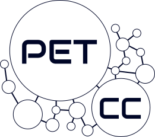

---
layout: home 
title: Minicurso de Introdução ao Desenvolvimento Spring
--- 

# Minicurso de Introdução ao Desenvolvimento Spring

  

    
  

  
  

    
  

  

    
  

  
  

    
  

Sejam bem-vindos ao Minicurso de **Introdução ao Desenvolvimento Spring** oferecido pelo PET-CC!

Este minicurso tem como objetivo introduzir participantes sem experiência prévia ao desenvolvimento web utilizando o Spring Framework – uma plataforma poderosa e consolidada para criação de aplicações empresariais em Java.

Ao longo do programa, percorreremos uma jornada estruturada que inclui:

- Revisão dos fundamentos de Java, base essencial para o trabalho com Spring

- Compreensão de APIs e do protocolo REST, explorando como sistemas se comunicam na web moderna

- Desenvolvimento prático de aplicações, desde a configuração inicial até a implementação de funcionalidades

- Documentação e boas práticas, assegurando que suas criações sejam claras, mantíveis e profissionais

Este espaço servirá como ponto central de acesso a todo o conteúdo do curso, incluindo materiais didáticos, exemplos de código, exercícios práticos e recursos complementares. Cada módulo foi planejado para construir gradualmente sua compreensão e habilidades, preparando-o para desenvolver soluções reais com confiança e fundamentação técnica.

**Dias de aula:**



