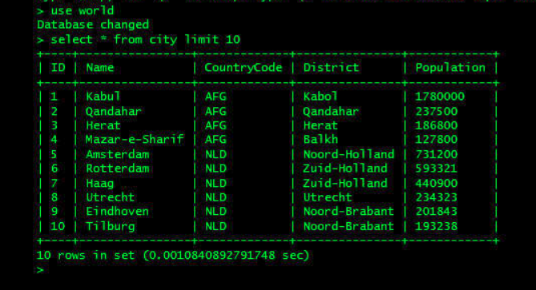

<div id="sumario" class="sumario-git">

<h1>Dia 2</h1>

  <details>
        <summary><a href="#o-que-são-apis">O que são APIs</a></summary>
        <ul>
            <li><a href="#comunicação-entre-sistemas-e-computadores">Comunicação entre sistemas e computadores</a></li>
            <li><a href="#protocolo-http">Protocolo HTTP</a></li>
        </ul>
  </details>

  <details>
         <summary><a href="#apis-restful">APIs RESTful</a></summary>
        <ul>
            <li><a href="#arquitetura-de-sistemas">Arquitetura de Sistemas</a></li>
            <li><a href="#arquitetura-em-camadas">Arquitetura em Camadas</a></li>
        </ul>
  </details>

  <details>
        <summary><a href="#camadas-do-sistema">Camadas do Sistema</a></summary>
        <ul>
            <li><a href="#camada-model">Camada Model</a></li>
            <li><a href="#camada-controller">Camada Controller</a></li>
            <li><a href="#camada-repository">Camada Repository</a></li>
            <li><a href="#camada-service">Camada Service</a></li>
        </ul>
  </details>

  <details>
        <summary><a href="#organização-e-prática">Organização e Prática</a></summary>
        <ul>
            <li><a href="#fluxo-entre-as-camadas">Fluxo entre as Camadas</a></li>
            <li><a href="#mantendo-o-sistema-organizado">Mantendo o Sistema Organizado</a></li>
            <li><a href="#a-importância-do-design-da-api">A Importância do Design da API</a></li>
            <li><a href="#exercício-prático-live-coding">Exercício Prático (Live Coding)</a></li>
        </ul>
  </details>
    <button class="toggle-button" id="toggle-button">
  
      Esconder Sumário
  
  </button>
  </div>
<br>

## Resumo do segundo dia

Nesta aula, veremos um pouco mais sobre conceitos base do desenvolvimento Back End, além de iniciar nossas primeiras implementações. Começaremos a aula explicando o que são APIs e, logo após, falaremos um pouco sobre protocolo HTTP e APIs RESTful, que são o foco do nosso minicurso. Após isto, falaremos sobre duas camadas muito importantes de um sistema back-end, a camada *model* e a camada *controller*, e discorreremos sobre como o Spring lida com essas camadas.

## O que são APIs

<div style="text-align: center;"> 
</div>

API é uma sigla para *Application Programming Interface*, e é basicamente uma série de "regras", implementadas em uma linguagem de programação específica, que permite que diferentes sistemas se comuniquem.

Mas por que precisamos dessas regras?

## Comunicação entre sistemas e computadores

Sabemos que computadores interpretam dados de forma 100% lógica e literal, portanto, precisam de regras bem definidas para conversar entre si numa mesma **rede**. Um dos exemplos mais famosos desse tipo de "regra" (que chamamos de protocolo) é o **protocolo HTTP**

### Protocolo HTTP

O protocolo HTTP é baseado em um modelo chamado **modelo cliente-servidor**, onde um computador (cliente) faz *requisições* a outro computador (servidor). Estas requisições são as tais mensagens que estávamos falando na seção anterior, e elas possuem um formato bem específico:

1. O método (*method*)
  - O que queremos fazer
2. O caminho (*path*)
  - Onde, na aplicação, queremos fazer
3. O cabeçalho (*header*)
  - Onde, na internet, queremos fazer
  - Informações adicionais

Entender como funciona o protocolo HTTP é muito importante para aspirantes do desenvolvimento Web, pois muitos assuntos giram em torno dele nessa área, um deles sendo o tipo específico de API que iremos estudar nesse curso: a **API RESTful**.

## APIs RESTful

APIs RESTful são APIs que seguem o estilo de arquitetura REST, que é definido no livro *Microservice APIs* como *"um estilo arquitetural para a construção de APIs fracamente acopladas e altamente escaláveis. As APIs REST são estruturadas em torno de recursos, entidades que podem ser manipuladas por meio da API."*.

Sendo assim, as APIs RESTful baseiam se em definir regras para a manipulação de recursos dentro de um sistema, e esses recursos estão diretamente localizados em um lugar chamado *endpoint*, dentro do servidor.

Vamos ver um exemplo para facilitar as coisas:

Digamos que você (cliente) esteja acessando um site de compras, e adicionando várias coisas no seu carrinho. Depois de escolher mil e uma coisas desnecessárias que você nunca vai comprar, você decide visualizar a sua grande lista de futilidades clicando em "Meu Carrinho", e assim aparece uma lista de vários produtos. Esses produtos muito provavelmente estão guardados em um *endpoint* com o seguinte formato: `/api/clientes/seu_id/carrinho/`

Portanto, temos um **lugar na aplicação** (*endpoint*), um **lugar na internet** (site de compras) e uma **ação específica que queremos fazer** (visualizar).

Veja que isso é muito parecido com o protocolo HTTP! Entende porque falamos dele no início da aula?

<div style="text-align: center;"> 
</div>

OBS.: É importante lembrar que APIs RESTful são *baseadas* no protocolo HTTP (utilizam muitos métodos do protocolo), mas que não *seguem-o* à risca.

## Arquitetura de Sistemas

<div style="text-align: center;">

</div>

- Forma como um sistema é organizado internamente.
- Define responsabilidades, comunicação e separação de partes.
- Importante para manutenção, escalabilidade e trabalho em equipe.

---

## Arquitetura em Camadas

<div style="text-align: center;">

</div>

- Separação de responsabilidades.
- Cada camada tem um papel bem definido.
- Camadas comuns em aplicações Spring:
  - Model
  - Controller
  - Service
  - Repository

---

## Camada Model

A camada Model representa o domínio da aplicação, ou seja, os objetos que descrevem os dados e conceitos centrais do sistema, como Livro, Usuário, Pedido ou Produto. Ela define os atributos que cada entidade possui e, em muitos casos, é mapeada diretamente para tabelas do banco de dados por meio de anotações como @Entity, @Id e @GeneratedValue. O Model é utilizado por todas as outras camadas, pois ele é a estrutura base que trafega entre Controller, Service e Repository. Além de armazenar dados, pode conter comportamentos simples relacionados à própria entidade, mas não deve concentrar regras complexas de negócio.


Exemplo de uma tabela criada no mysql:
<div style="text-align: center;">

</div>


Exemplo de uma 
classe Entity Pessoas:
```java
import jakarta.persistence.Entity;
import jakarta.persistence.Table;
import jakarta.persistence.GenerationType;
import jakarta.persistence.Id;

@Entity(name = "pessoas")
@Table(name = "pessoas")
public class Pessoas {
  @Id
  @GeneratedValue(strategy = Generation.Type.IDENTITY)
  private Long id;
  private String nome;
  private Integer idade;
  private String cpf;
  private String email;
  private String senha;
}
```

---

## Camada Controller

A classe Controller no Spring é o componente responsável por receber requisições HTTP, interpretar os dados enviados pelo cliente e retornar uma resposta adequada. Quando utilizamos a anotação @RestController, estamos dizendo ao Spring que aquela classe é um controlador web e que seus métodos irão retornar dados diretamente no corpo da resposta HTTP (geralmente em JSON), e não uma página HTML. Internamente, @RestController é a combinação de @Controller + @ResponseBody, o que significa que todo método já retorna o objeto serializado automaticamente.

Agora, para entender stateless e stateful, precisamos falar sobre estado (state). Estado é qualquer informação que precisa ser mantida entre uma requisição e outra. Em aplicações web tradicionais, especialmente as baseadas em renderização de páginas no servidor (como JSP ou Thymeleaf), o servidor frequentemente mantém informações da sessão do usuário em memória. Isso caracteriza uma aplicação stateful.

Uma aplicação stateful mantém estado no servidor entre requisições. Isso normalmente acontece através de sessões HTTP.  Exemplo:

```java
@Controller
@SessionAttributes("usuarioLogado")
public class LoginController {

    @PostMapping("/login")
    public String login(@RequestParam String email, Model model) {
        model.addAttribute("usuarioLogado", email);
        return "home";
    }
}
```
Aqui:
 - O servidor guarda informações da sessão.
 - Cada usuário possui um estado armazenado.
 - O servidor precisa lembrar quem está logado.

Características de aplicações stateful:
 - Usa sessão (HttpSession)
 - Armazena dados do usuário em memória no servidor
 - Muito comum em aplicações web antigas baseadas em páginas

Agora, uma aplicação stateless não mantém estado no servidor entre requisições. Cada requisição precisa conter todas as informações necessárias para ser processada.

Exemplo com REST:

```java
@RestController
@RequestMapping("/livros")
public class LivroController {

    @GetMapping
    public List<Livro> listar() {
        return service.listar();
    }
}
```
Vemos aqui:
 - O servidor não guarda informação da requisição anterior.
 - Cada chamada é independente.
 - Se houver autenticação, o token (ex: JWT) vai em cada requisição no header.

 Características de aplicações stateless:
 - Não usa sessão do servidor
 - Cada requisição é independente
 - Mais fácil de escalar (microservices)
 - Ideal para APIs REST

### Exemplos de métodos

- getUsuario
- createProduto
- removeProduto

### Anotações comuns

- @RestController
- @GetMapping
- @PostMapping

---

## Camada Repository

A camada Repository é responsável pela persistência dos dados, ou seja, pela comunicação direta com o banco de dados. Ela executa operações como salvar, atualizar, buscar e remover registros. No Spring, geralmente é implementada como uma interface que estende JpaRepository, permitindo o uso de métodos prontos para CRUD sem necessidade de implementação manual. O Repository deve focar exclusivamente no acesso a dados, sem conter regras de negócio, mantendo assim a responsabilidade bem definida dentro da arquitetura em camadas.

```java
import org.springframework.data.jpa.repository.JpaRepository;
import java.util.Optional;

public interface UserRepository extends JpaRepository<User, Long> {
    Optional<User> findUserById(Long id);
    Optional<User> findUserByDocument(String document);
    Optional<User> findUserByEmail(String email);
}
```

### Exemplos

- findById
- findByNome
- save
- delete

### No Spring

- Extende JpaRepository
- Anotação: @Repository

---

## Camada Service

A camada Service concentra a lógica de negócio do sistema. É nela que ficam as regras que definem como o sistema deve se comportar, como validações, cálculos, verificações de permissões, regras de consistência e orquestração de múltiplas operações. A Service atua como intermediária entre o Controller e o Repository, garantindo que os dados sejam processados corretamente antes de serem persistidos ou retornados. Essa separação facilita a manutenção, os testes automatizados e a evolução do sistema, pois a lógica fica centralizada em um único ponto, evitando duplicação e acoplamento excessivo.

```java
@Service
public class UserService {

    @Autowired
    private UserRepository repository;

    public void validationUserTransaction(User sender, BigDecimal amount) throws Exception {
        if(sender.getType() != UserType.COMMON){
            throw new Exception("User type not allowed to do a transfer");
        }
        if(sender.getBalance().compareTo(amount) < 0){
            throw new Exception("User has not enough money to complete the transaction");
        }

    }

    public User findUserById(Long id) throws Exception {
        return this.repository.findUserById(id).orElseThrow(
                () -> new Exception("User not found")
                );
    }

    public void saveUser(User user) {
        this.repository.save(user);
    }
}
```

### Exemplo

- realizarCompra:
  - valida usuário
  - verifica estoque
  - calcula valor
  - processa pagamento

### No Spring

- Anotação: @Service

---

## Fluxo entre as Camadas

Controller -> Service -> Repository -> Banco  
Model é utilizado por todas as camadas.

---

## Mantendo o Sistema Organizado

- Organização facilita manutenção.
- Reduz bugs.
- Facilita testes e evolução do sistema.

---

## A Importância do Design da API

- Define como o cliente interage com o sistema.
- Boas APIs são:
  - previsíveis
  - semânticas
  - consistentes
  - RESTful

---

## Exercício Prático (Live Coding)

- Implementação de um sistema de biblioteca.
- Foco nas camadas:
  - Model
  - Controller
  - Repository

### Funcionalidades

- Cadastro de livros
- Listagem de livros
- Integração com banco de dados

## Como Compilar o Projeto?

- mvn clean            --> limpa
- mvn compile          --> compila
- mvn test             --> testa
- mvn package          --> gera JAR
- mvn install          --> instala no .m2
- mvn clean install    --> padrão
- mvn clean install -X --> debug
- mvn spring-boot:run  --> roda a app

Neste curso, iremos usar, principalmente:
- mvn clean install
- mvn spring-boot:run
